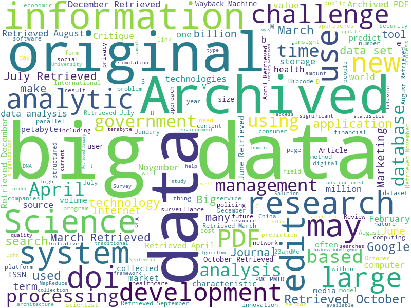
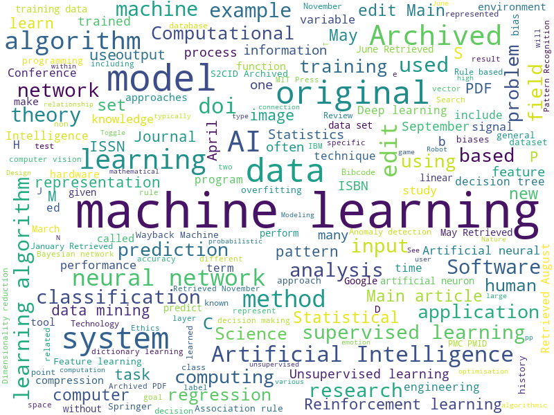

## Assignments

* **Task 1**: Modify this code [`notebook.ipynb`](/1-Introduction/01-defining-data-science/notebook.ipynb ':ignore') to find out related concepts for the fields of **Big Data** and **Machine Learning**
* **Task 2**: [Think About Data Science Scenarios](assignment.md)

## Results
* **Task 1**
# Word Cloud for Big Data

# Word Cloud for Machine Learning

